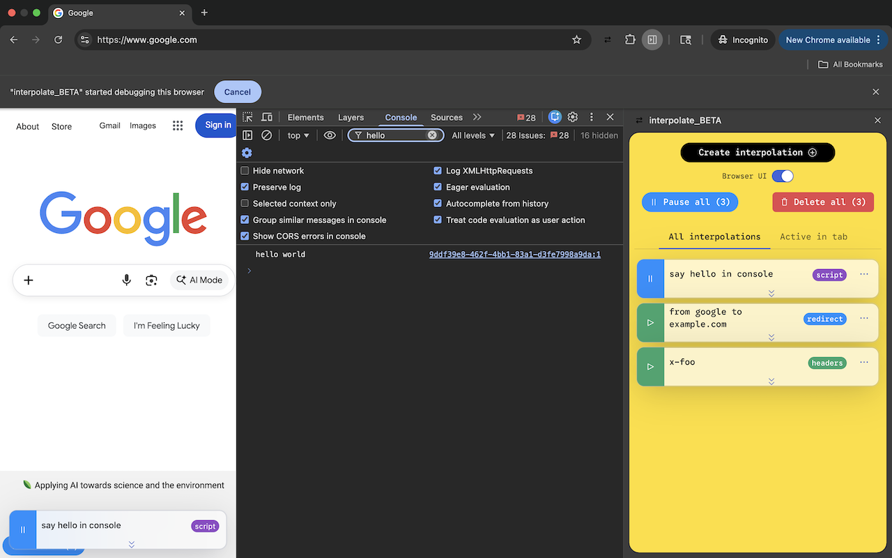
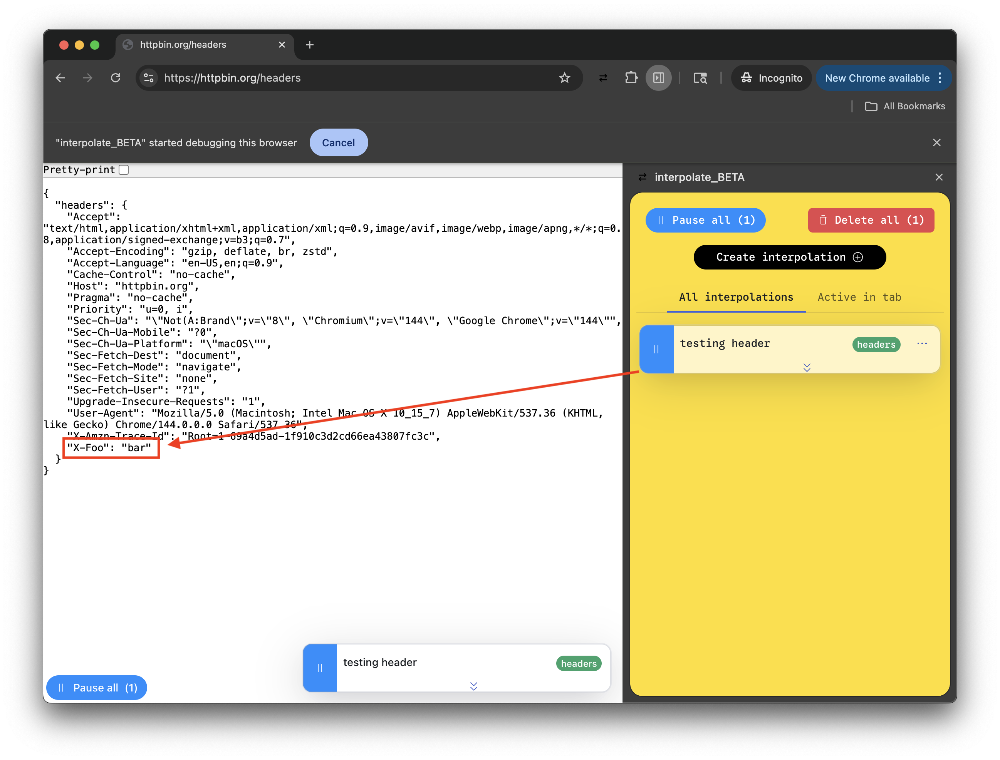
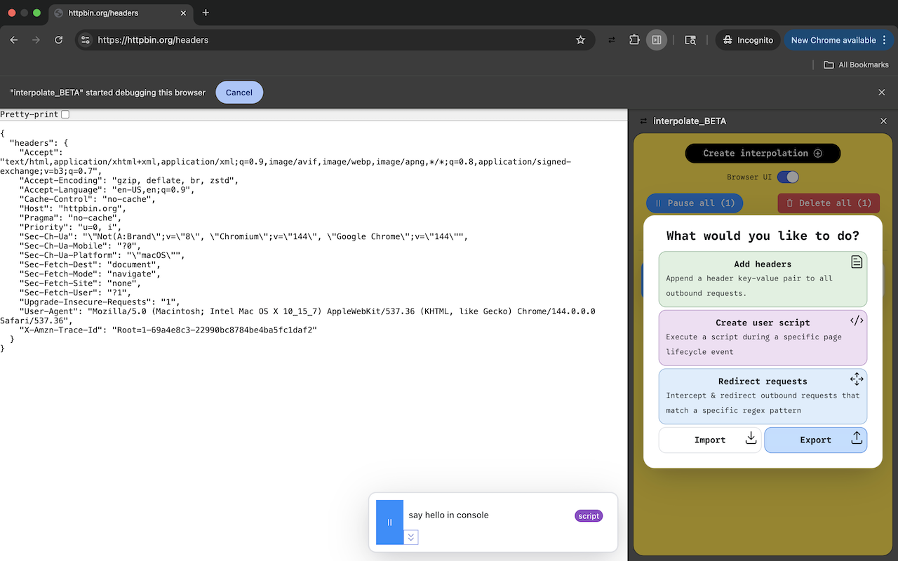
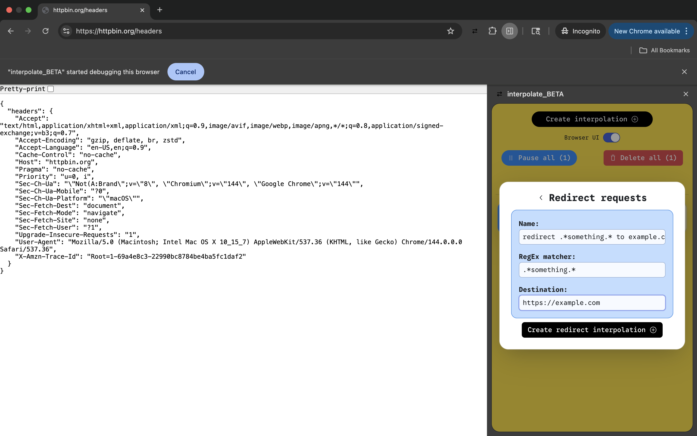
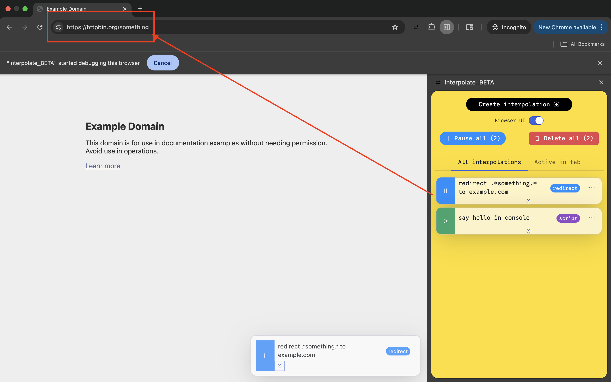

# Interpolate web extension [beta]

> [!WARN] this extension is in beta and is subject to breaking changes

[Privacy Policy](./PRIVACY.md)

Interpolate scripts, redirects, and headers into the current tab.

#### User Script Interpolations

Create and manage user scripts that, when enabled, can be executed during specific document lifecycle events like `"document_start"`, `"document_end"`, or `"document_idle"`

#### Header Interpolations

Append headers to outbound requests.

#### Redirect Interpolations

Intercept and redirect requests that match a regex expression.

