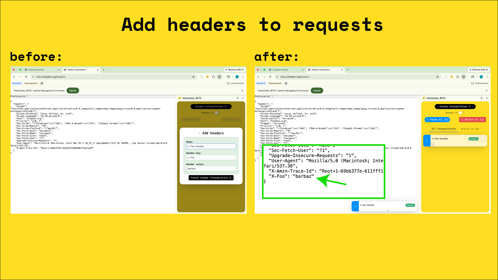
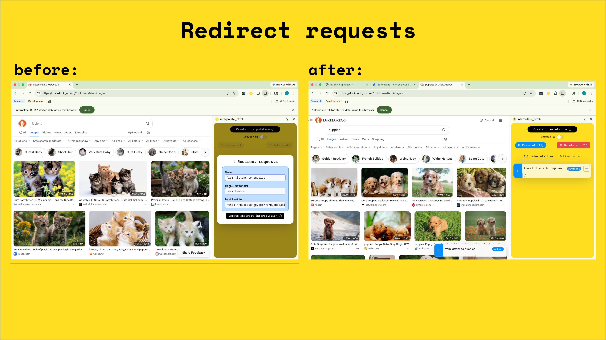
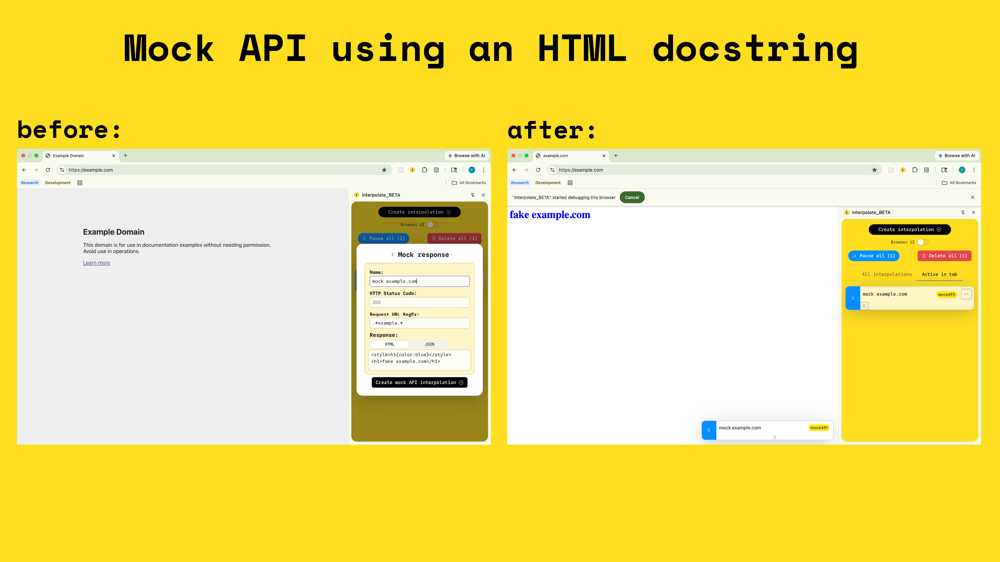
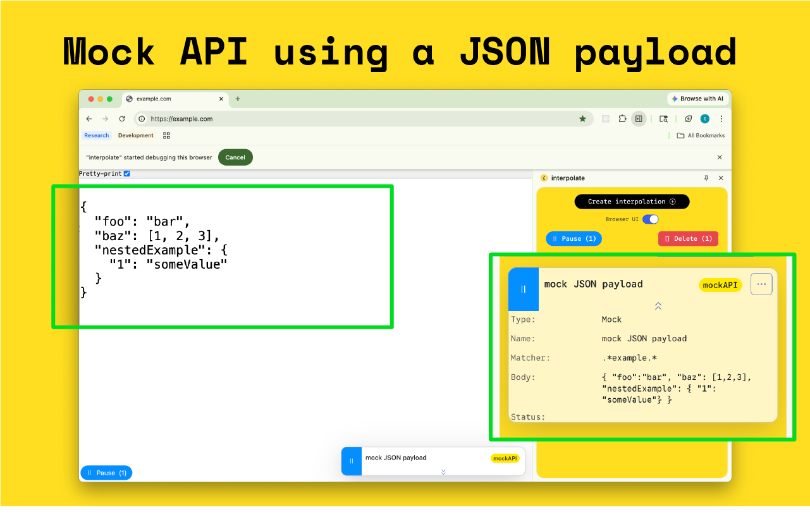
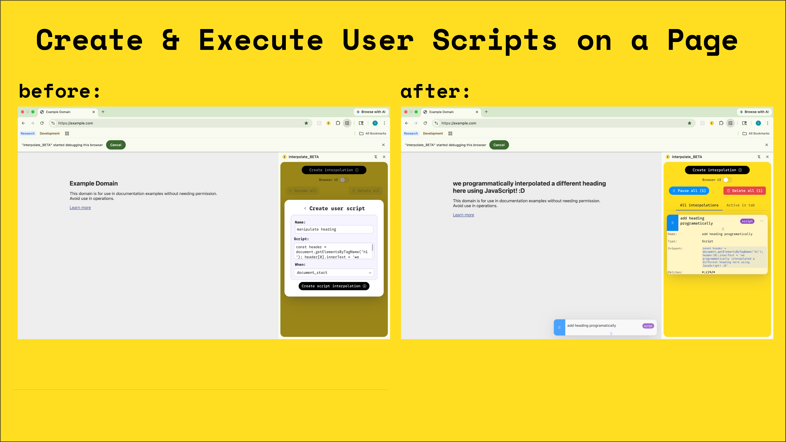

> [!WARN] Currently there is a bug where user created scripts are broken
> and will not execute in the browser as expected
> 
> Please follow the issue at https://github.com/thomasgrz/interpolate-extension/issues/109

# Interpolate web extension [beta] 

> [!WARN] this extension is in beta and is subject to breaking changes

[Currently available in Chrome Web Store](https://chromewebstore.google.com/detail/interpolatebeta/hjcffgbkfajlmfpmjijiafmlbeofhbpe)

[Privacy Policy](./PRIVACY.md)

[Built with CRXJS](https://github.com/crxjs/chrome-extension-tools)

Interpolate allows developers to easily, and declaratively, do things like:

1. add headers to all outbound requests
2. redirect any subset of requests on a page
3. mock API responses with HTML docstrings or JSON payloads
4. create & execute user scripts

Interpolate configurations are reusable and modular -- they can easily be exported and imported as JSON.

#### Add Headers

Append headers to outbound requests.

#### Redirect Requests

Intercept and redirect requests that match a regex expression.

#### Mock APIs

Intercept and mock responses to requests that match a regex expression.

#### Execute Scripts

Create and manage user scripts that, when enabled, can be executed during specific document lifecycle events like `"document_start"`, `"document_end"`, or `"document_idle"`

