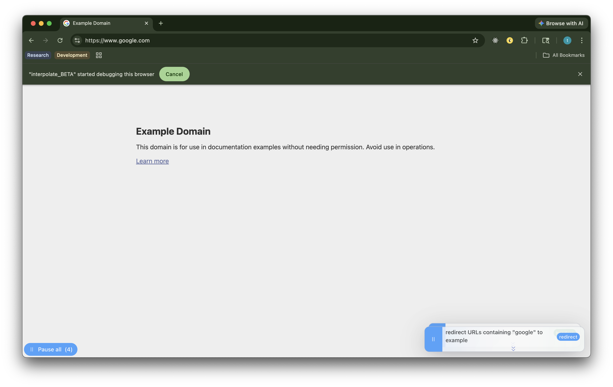
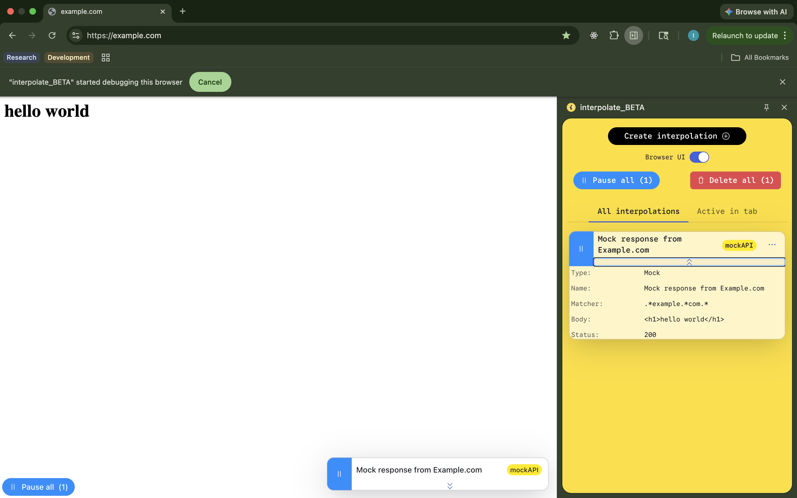
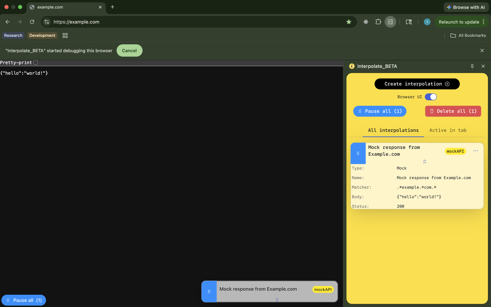

# Interpolate web extension [beta] 

> [!WARN] this extension is in beta and is subject to breaking changes

[Currently available in Chrome Web Store](https://chromewebstore.google.com/detail/interpolatebeta/hjcffgbkfajlmfpmjijiafmlbeofhbpe)

[Privacy Policy](./PRIVACY.md)

[Built with CRXJS](https://github.com/crxjs/chrome-extension-tools)

Interpolate allows developers to easily, and declaratively, do things like:
1. mock API responses with HTML or JSON payloads
2. add headers to requests
3. create & execute scripts
4. redirect any subset of requests

Interpolate configurations are reusable and modular -- they can easily be exported and imported as JSON.

#### User Script Interpolations

Create and manage user scripts that, when enabled, can be executed during specific document lifecycle events like `"document_start"`, `"document_end"`, or `"document_idle"`

#### Header Interpolations

Append headers to outbound requests.

#### Redirect Interpolations

Intercept and redirect requests that match a regex expression.

#### Mock API Interpolations

Intercept and mock responses to requests that match a regex expression.

| Mocked HTML response                                                                        | Mocked JSON payload response                                                                    |
| ------------------------------------------------------------------------------------------- | ----------------------------------------------------------------------------------------------- |
|  |  |
